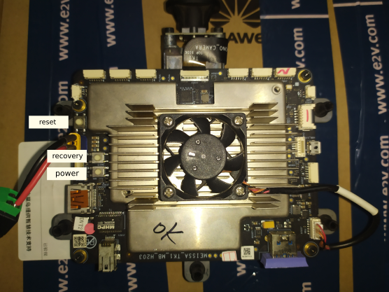
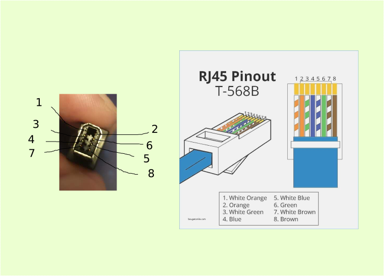

# README

## 硬件




网口需要定制，接线图如下。这个是按附带的剪线插头的颜色推的，只在原安卓系统下测试过，安卓能显示有线连接图标，但未能联网。（刷系统不需要网线）




## 刷系统

基本按照官方[Quick Start Guides](https://developer.nvidia.com/embedded/dlc/quick-start-guide-r218)操作。有几个注意点

1. 进入recovery模式的方式为，通电状态下，按住recovery按后点一下reset即可。如果成功，PC端会显示识别到如下usb设备

   ```
   Bus 001 Device 029: ID 0955:7740 NVidia Corp. 
   ```

   识别到这个设备后可以用根据官方方法烧写系统

2. 另外由于这个是非官方的板子，因此需要把jetson-tk1.conf这个配置文件下的BOARDID参数的注释去掉。


## 目前问题

刷入官方系统后无法启动，可能是电源管理的问题。显示如下

